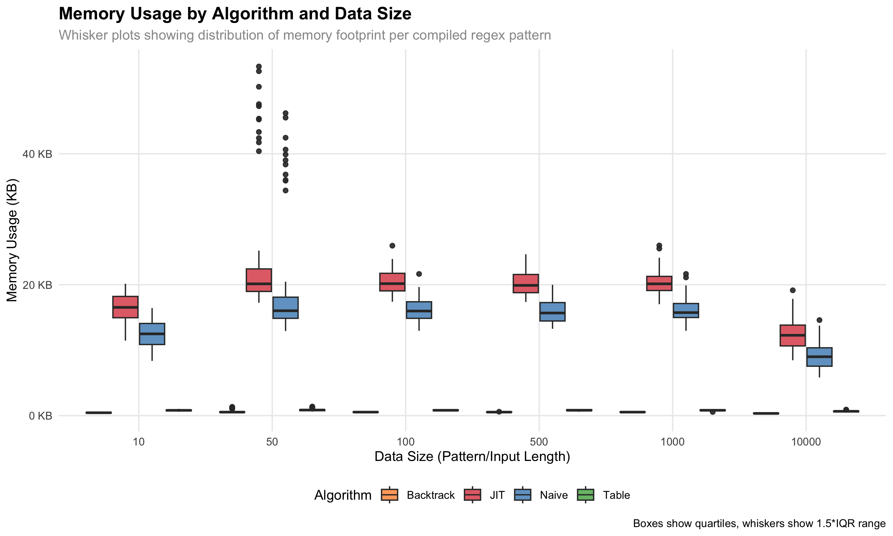
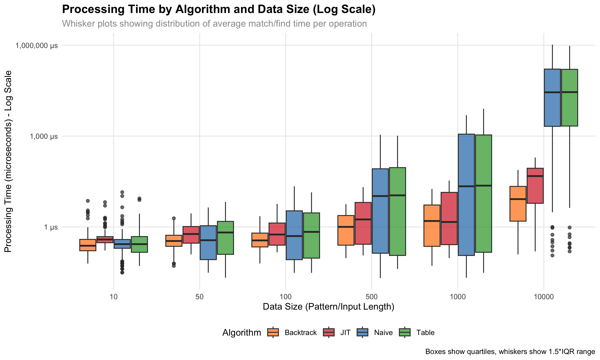

# regex-compiler

A comparative regex evaluation project in Java

### To build

```
jenv global 21.0.1
mvn clean compile test-compile
```

### Run battery of tests

```
mvn clean compile test-compile test
```

### Test individual files

```
mvn exec:java -Dexec.mainClass="com.wespiser.regexcompiler.RegexParser"
mvn exec:java -Dexec.mainClass="com.wespiser.regexcompiler.RegexToDFA"
```

### Performance Test

```
mvn clean compile test-compile
mvn exec:java -Dexec.mainClass="com.wespiser.regexcompiler.RegexPerformanceTest" -Dexec.classpathScope="test" -X
```

### Performance Results

```
Performance ranking (lower is better):
  Table: 13.5 ns/match
  DFA: 14.1 ns/match
  Backtrack: 16.7 ns/match
```

## Comprehensive Benchmarking

This project includes a comprehensive benchmarking system that compares memory usage and processing time across all three regex implementations (DFA, Backtrack, Table) using generated test data of varying sizes.

### Running the Benchmark

The benchmark system generates test data and measures performance across different pattern/input sizes (10, 50, 100, 500, 1000 characters).

**Quick start:**
```bash
./run_benchmark.sh
```

**Manual steps:**
```bash
# 1. Compile the project
mvn clean compile

# 2. Generate test data
java -cp target/classes com.wespiser.regexcompiler.BenchmarkDataGenerator

# 3. Run benchmarks (may take several minutes)
java -cp target/classes com.wespiser.regexcompiler.RegexBenchmark

# 4. Generate analysis plots (requires R with ggplot2)
cd analysis
Rscript benchmark_analysis.R
```

### Benchmark Results

The benchmark measures:
- **Memory Usage**: Heap memory footprint per compiled regex pattern
- **Processing Time**: Average time for match() and find() operations
- **Data Coverage**: 100 patterns per size category × 3 algorithms × 2 input types = 3000 test cases

#### Memory Usage Comparison



*Whisker plot showing memory footprint distribution across data sizes. DFA shows highest memory usage due to state tables, Backtrack shows lowest with simple parse trees.*


*Same data with logarithmic y-axis to better show relative differences between algorithms.*

#### Processing Time Comparison


*Whisker plot showing processing time distribution across data sizes. Shows average of match() and find() operation times.*



*Same data with logarithmic y-axis to highlight performance variations across different pattern complexities.*

### Key Findings

- **DFA**: High memory usage (1-29 KB), moderate processing time. Best for repeated pattern matching.
- **Backtrack**: Low memory usage (141-869 bytes), variable processing time. Memory efficient but can be slow on complex patterns.
- **Table**: Moderate memory usage (453-1197 bytes), optimized processing time. Good balance of memory and performance.