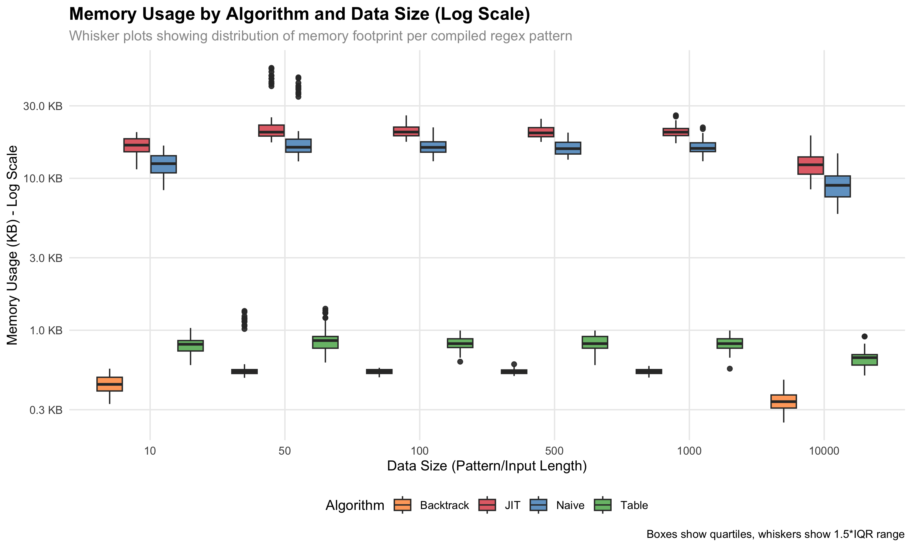
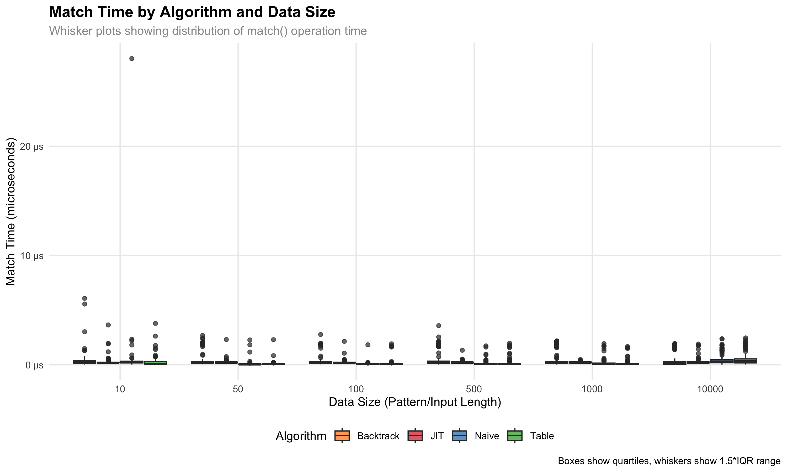

# regex-compiler

A comparative regex evaluation project in Java

### To build

```
jenv global 24
./mvn24 clean compile test-compile
```

### Run battery of tests

```
mvn clean compile test-compile test
```

### Test individual files

```
./mvn24 exec:java -Dexec.mainClass="com.wespiser.regexcompiler.RegexParser"
./mvn24 exec:java -Dexec.mainClass="com.wespiser.regexcompiler.RegexToDFA"
```

### Performance Test

```
./mvn24 clean compile test-compile
./mvn24 exec:java -Dexec.mainClass="com.wespiser.regexcompiler.RegexPerformanceTest" -Dexec.classpathScope="test" -X
```

## Benchmarking

This project includes a comprehensive benchmarking system that compares memory usage and processing time across all three regex implementations (DFA, Backtrack, Table) using generated test data of varying sizes.

### Running the Benchmark

The benchmark system generates test data and measures performance across different pattern/input sizes (10, 50, 100, 500, 1000 characters).

**Quick start:**
```bash
./run_benchmark.sh
```

### Benchmark Results

The benchmark measures:
- **Memory Usage**: Heap memory footprint per compiled regex pattern
- **Processing Time**: Average time for match() and find() operations
- **Data Coverage**: 100 patterns per size category × 3 algorithms × 2 input types = 3000 test cases

#### Memory Usage Comparison




#### Processing Time Comparison


#### Match Time Comparison



